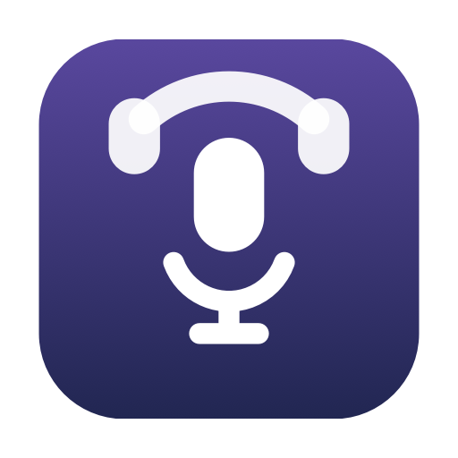

# BoseMicToggle

Кнопка play/pause на Bluetooth-наушниках мьютит и анмьютит микрофон в Zoom.

Маленький агент в меню-баре для macOS. Без зависимостей: один файл на Swift,
собирается системным `swiftc`.

- Иконка в меню-баре показывает состояние микрофона
- Звуковое подтверждение переключения
- Горячая клавиша `Ctrl+Alt+Cmd+M`
- Слушает кнопку только во время митинга, в остальное время не работает и
  ресурсов не ест

## Почему это вообще нетривиально

Во время звонка гарнитура переключается из A2DP в профиль HFP (16 кГц моно).
В HFP многофункциональная кнопка -- это управление вызовом, а не медиа-клавиша:
наушники присылают AT-команду `AT+CHUP` («сбросить вызов») по RFCOMM.

Эту команду принимает системный `bluetoothd` и приложениям не отдаёт. Проверено,
что её нет:

| Слой | Результат |
|---|---|
| Поток CGEvent (`hs.eventtap`, Karabiner) | нажатие не приходит |
| MediaRemote / `MPRemoteCommandCenter` | не приходит (приходит только синтезированная медиа-клавиша) |
| HID (`IOHIDManager`) | для Bluetooth-гарнитуры устройство не создаётся; найденные Consumer-Control `Headset` принадлежат встроенному кодеку, то есть разъёму 3.5 мм |
| RFCOMM (`IOBluetoothRFCOMMChannel`) | канал занят системой, вторым слушателем не подключиться |

Единственный публичный способ увидеть нажатие -- unified log: `bluetoothd`
пишет туда `Received call hangup event (AT+CHUP) from device <адрес>` и не
редактирует адрес. Агент читает `log stream` с узким предикатом.

**Это скрейпинг системного лога.** Публичного API для этого сигнала не
существует, а формулировка сообщения не является контрактом: Apple может
переименовать его в любом обновлении macOS, и триггер молча перестанет
работать. Для диагностики в меню есть пункт «Проверить сигнал кнопки» -- он
показывает, сколько нажатий система записала за последние 10 минут.

## Требования

- macOS 13+ (проверено на macOS 26)
- Apple Silicon (в `build.sh` зашит `arm64`; для Intel поменяйте `-target`)
- Zoom с интерфейсом на английском или русском (см. `micMenuTitles` в коде)
- Инструменты командной строки Xcode: `xcode-select --install`

## Установка

```sh
git clone https://github.com/evtaranov/BoseMicToggle.git
cd BoseMicToggle
./build.sh
open -a ~/Applications/BoseMicToggle.app
```

Дальше нужно выдать **Accessibility** -- без него агент не прочитает меню Zoom:

> Системные настройки → Конфиденциальность и безопасность → Универсальный доступ

Добавьте `~/Applications/BoseMicToggle.app` кнопкой `+` и включите тумблер.
После этого перезапустите агента («Выйти» в его меню, затем `open -a` заново).

Проверить, что права применились:

```sh
grep 'accessibility trusted' ~/Library/Logs/BoseMicToggle.log | tail -1
```

### Автозапуск при входе

```sh
./install-autostart.sh            # поставить
./install-autostart.sh --uninstall  # снять
```

Скрипт генерирует LaunchAgent с путём вашего пользователя: `launchd` не
понимает `~` и требует абсолютный путь. Агент запускается через `/usr/bin/open`,
а не бинарником напрямую -- так приложение получает bundle-идентичность, от
которой зависит грант Accessibility.

## Настройка

Всё меняется без пересборки, после изменения агента надо перезапустить.

```sh
# Громкость подтверждения (доля от системной)
defaults write io.github.bosemictoggle soundVolume -float 0.35

# Звуки: имена файлов из /System/Library/Sounds.
# Префикс reversed: проигрывает звук задом наперёд -- так получается пара
# одного тембра, нарастающая и спадающая.
defaults write io.github.bosemictoggle soundUnmuted reversed:Bottle
defaults write io.github.bosemictoggle soundMuted Bottle
defaults write io.github.bosemictoggle soundFailed Basso

# Выгрузить меню Zoom в лог при следующем запуске -- нужно, если Zoom
# переименует пункты и переключение перестанет находиться
defaults write io.github.bosemictoggle dumpMenu -bool true
```

Развёрнутые звуки кэшируются в `~/Library/Application Support/BoseMicToggle/`.
Чтобы пересоздать -- удалите папку.

## Как это устроено

| Файл | Назначение |
|---|---|
| `main.swift` | весь агент |
| `build.sh` | сборка `.app` в `~/Applications` |
| `make-icon.swift` | рисует иконку кодом, собирает `AppIcon.icns` |
| `Info.plist` | `LSUIElement` -- агент без иконки в Dock |
| `install-autostart.sh` | LaunchAgent автозапуска |

Внутри `main.swift`:

- **Триггер** -- `log stream` по `bluetoothd` с предикатом на `AT+CHUP`.
  Запускается только на время митинга: процесс `log` стоит около 7% CPU.
  Если он падает (например, после сна), поднимается заново.
- **Мьют** -- нажатие пункта `Meeting → Mute/Unmute audio` через Accessibility.
  Меню не открывается и фокус на Zoom не переключается.
- **Определение митинга** -- по наличию того же пункта меню; вне митинга
  Zoom его не показывает. Опрос раз в 4 секунды, он же даёт состояние
  микрофона для иконки.

## Известные ограничения

- **Только Zoom.** Для других приложений нужно дописать свой способ мьюта.
- **Кнопка присылает «сбросить вызов».** В Zoom это ни на что не влияет, но
  если параллельно идёт настоящий звонок (FaceTime, телефон через iPhone), то
  же нажатие его повесит. Это делает macOS раньше, чем агент видит событие.
- **Права слетают при каждой пересборке.** Подпись ad-hoc, поэтому хэш кода
  меняется и macOS считает сборку новым приложением. Лечится только удалением
  записи из списка Универсального доступа кнопкой `-` и добавлением заново;
  переключение галочки на старой записи не помогает. Чтобы это прекратилось,
  нужна стабильная подпись вместо ad-hoc.
- **Привязка к названиям пунктов меню Zoom.** Поддержаны английский и русский
  интерфейс; для другого языка добавьте строки в `micMenuTitles`.

## Диагностика

```sh
tail -f ~/Library/Logs/BoseMicToggle.log
```

Нажатия кнопки видны в системном логе независимо от агента:

```sh
log show --last 10m --debug --predicate 'eventMessage CONTAINS "AT+CHUP"'
```

Если тут пусто, а кнопку нажимали -- сигнал до macOS не доходит либо Apple
переименовала сообщение. Если тут есть записи, а агент не реагирует --
проблема на стороне агента, смотрите его лог.

## Лицензия

MIT
